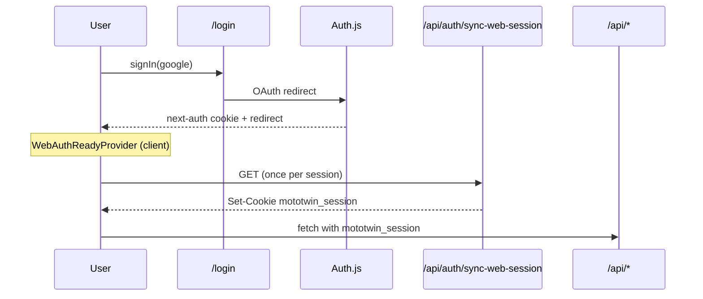

# Web-аутентификация (архитектура)

Каноническое описание web-сессий, защиты маршрутов и клиентских контрактов после рефакторинга устойчивости (2026-06).

См. также: [auth-oauth-production.md](./auth-oauth-production.md) (OAuth env и Google Console), [auth-implementation-plan.md](./auth-implementation-plan.md) (история фаз), [api-backend.md](./api-backend.md) §3.10.

---

## 1. Два слоя сессии на web

| Способ входа | Клиент | Cookie / хранилище | Таблица БД |
|--------------|--------|-------------------|------------|
| Email + пароль | `POST /api/auth/login` | `mototwin_session` | `auth_sessions` |
| Google / Apple / Yandex | Auth.js `signIn()` | `next-auth.session-token` (+ chunks) | `authjs_sessions` |

Оба пути сходятся в **`resolveAuthenticatedUserId()`** — единая точка резолва на сервере: [src/lib/auth/request-auth.ts](../src/lib/auth/request-auth.ts).

Порядок проверки:

1. `Authorization: Bearer <accessToken>` (mobile / API)
2. cookie `mototwin_session`
3. cookie Auth.js (`next-auth.session-token`, chunked)
4. fallback через `auth()` (Auth.js)

API-ручки и SSR-guards **не различают** способ входа — достаточно любого валидного источника.

---

## 2. Мост OAuth → `mototwin_session`

Auth.js после OAuth выставляет **свою** cookie. Большинство web API и `attachMototwinSessionCookieIfNeeded` ожидают **`mototwin_session`** (как при email/password).

Цепочка синхронизации:



Компоненты:

| Компонент | Файл | Роль |
|-----------|------|------|
| `AuthSessionProvider` | [AuthSessionProvider.tsx](../src/components/auth/AuthSessionProvider.tsx) | `SessionProvider` + `WebAuthReadyProvider` |
| `WebAuthReadyProvider` | [WebAuthReadyProvider.tsx](../src/components/auth/WebAuthReadyProvider.tsx) | Однократный `GET /api/auth/sync-web-session` после `status === "authenticated"` |
| `sync-web-session` | [sync-web-session/route.ts](../src/app/api/auth/sync-web-session/route.ts) | Минтит `mototwin_session` через `attachMototwinSessionCookieIfNeeded` |
| `attachMototwinSessionCookieIfNeeded` | [attach-web-session-cookie.ts](../src/lib/auth/attach-web-session-cookie.ts) | Не перезаписывает cookie, если уже принадлежит тому же userId |

`GET /api/auth/session-state` и `GET /api/auth/me` также могут минтить `mototwin_session`, если пользователь аутентифицирован через Auth.js, но cookie ещё не выдана.

---

## 3. Защита маршрутов (неблокирующая модель)

### SSR-guards (основной барьер)

Layout server components проверяют `resolveAuthenticatedUserId()` **до** отдачи HTML:

| Маршрут | Layout | Redirect |
|---------|--------|----------|
| `/garage/**` | [garage/layout.tsx](../src/app/garage/layout.tsx) | `/login?next=/garage` |
| `/profile/**` | [profile/layout.tsx](../src/app/profile/layout.tsx) | `/login?next=/profile` |

Неавторизованный пользователь **не получает** содержимое защищённой страницы — редирект на сервере.

### Клиентский probe (вторичный, неблокирующий)

`AuthGate` больше **не блокирует** UI спиннером «Загрузка…». Компонент:

- рендерит `children` сразу;
- в фоне вызывает `getWebSessionState()`;
- при `authenticated: false` делает `router.replace(/login?next=…)`;
- при ошибке сети/таймаута показывает **inline-предупреждение**, не перекрывая страницу.

Файл: [AuthGate.tsx](../src/components/auth/AuthGate.tsx).

На `/garage` и `/profile` `AuthGate` **не используется** — достаточно SSR-guard. Компонент остаётся для маршрутов без layout-guard, если понадобится.

### Страница логина

[login/page.tsx](../src/app/login/page.tsx) — **server component**: читает `searchParams`, санитизирует `next`, передаёт props в client [login-form.tsx](../src/app/login/login-form.tsx).

`sanitizeNextPath()` отсекает циклические редиректы (`/login`, `/register`, …) → fallback `/garage`.

Email/password login использует `createWebApiClient({ redirectOn401: false })`, чтобы **401 показывался в форме**, а не уводил обратно на `/login`.

---

## 4. API-контракты для web-клиента

### Лёгкая проверка сессии

`GET /api/auth/session-state` → `AuthSessionStateResponse`:

```json
{ "authenticated": true, "userId": "clx…" }
```

- Без подписки, без профиля — только факт входа.
- TTL кеша на клиенте: **15 с** (`getWebSessionState()`).
- Профиль API-клиента: `authProbe` (timeout 5 с, 1 попытка).

### Полная сессия / профиль

`GET /api/auth/me` → `AuthMeResponse` (user, garage, plan, capabilities).

- Кеш на клиенте: **60 с** (`getWebSession()`).
- `?mode=lite` — без загрузки subscription (быстрее для UI, где план не нужен).

### Выход

`POST /api/auth/logout` — revoke `mototwin_session` **и** все известные Auth.js cookies (включая chunked). Клиент: `clearWebSessionCache()`.

---

## 5. Клиентский API-слой

### Профили `createWebApiClient`

Файл: [create-web-api-client.ts](../src/lib/create-web-api-client.ts).

| Профиль | Timeout | Retries | Использование |
|---------|---------|---------|---------------|
| `authProbe` | 5 с | 1 | `getWebSessionState`, AuthGate |
| `default` | 12 с | 2 | большинство UI-запросов |
| `heavyRead` | 25 с | 2 | `GET /api/garage` с attention |

`redirectOn401: true` (default) — редирект на `/login?next=…`. Для формы логина и auth-probe: **`false`**.

### Дедупликация и кеш

Файл: [web-api-dedup.ts](../src/lib/web-api-dedup.ts).

| Функция | Endpoint | Кеш |
|---------|----------|-----|
| `getWebSessionState()` | `/api/auth/session-state` | 15 с, inflight dedupe |
| `getWebSession()` | `/api/auth/me` | 60 с, inflight dedupe |
| `getGarageVehiclesDeduped({ includeAttention })` | `/api/garage` | inflight по ключу `with/without-attention` |
| `clearWebSessionCache()` | — | полный сброс (logout, успешный login) |
| `invalidateWebSessionCache()` | — | только session caches (ошибка probe) |

### Гараж: двухфазная загрузка

[garage/page.tsx](../src/app/garage/page.tsx):

1. **Быстро:** `includeAttention: false` — список мотоциклов без расчёта attention.
2. **Фон:** `includeAttention: true` — обновление карточек с attention-бейджами.

На сервере attention кешируется in-memory ~20 с ([garage/route.ts](../src/app/api/garage/route.ts)).

Sidebar ([GarageSidebar.tsx](../src/app/garage/_components/GarageSidebar.tsx)) показывает inline-предупреждения при ошибках загрузки сессии или гаража.

---

## 6. Типы

Пакет `@mototwin/types`: [packages/types/src/auth.ts](../packages/types/src/auth.ts).

- `AuthMeResponse` — полный профиль для UI.
- `AuthSessionStateResponse` — `{ authenticated, userId }` для guards.

---

## 7. Локальная разработка

### Тестовые пользователи

```bash
npx tsx scripts/seed-beta-test-users.ts
```

Создаёт аккаунты `test1@mototwin.online` … с паролями из скрипта. **Мотоциклы не создаёт** — только user + пустой garage.

### Типичные проблемы

| Симптом | Причина | Действие |
|---------|---------|----------|
| «Неверный email или пароль» на localhost | пользователь не засеян локально | `seed-beta-test-users.ts` |
| После входа снова `/login` | `next=/login…` в URL | исправлено `sanitizeNextPath`; очистить URL |
| OAuth работает, API 401 | нет `mototwin_session` | проверить `WebAuthReadyProvider` и `/api/auth/sync-web-session` |
| «Превышено время ожидания…» | медленная сеть / тяжёлый `/api/garage` | split-load + `heavyRead` profile; проверить VPS |
| Chrome: запрос «доступ к другим приложениям» | FedCM для federated login | ожидаемое поведение Chrome, не permission приложения |
| Пустой гараж после первого входа | bootstrap создаёт garage без vehicles | onboarding «Добавить мотоцикл» |

---

## 8. Smoke / QA

```bash
# Провайдеры OAuth
curl -s https://mototwin.online/api/auth/providers | jq .

# Auth smoke (register/login/block)
BASE_URL=https://mototwin.online npx tsx scripts/qa-auth-smoke.ts

# Локально
BASE_URL=http://localhost:3000 npx tsx scripts/qa-auth-smoke.ts
```

Ручная проверка web:

1. `/login` → email/password → редирект на `/garage` (или `next`).
2. Logout → `/garage` редиректит на `/login`.
3. Google OAuth → callback → `/garage`, в DevTools есть `mototwin_session`.
4. Медленная сеть: страница гаража **не** висит на полноэкранном «Загрузка…» до auth.

---

## 9. Связанные документы

- [auth-oauth-production.md](./auth-oauth-production.md) — production OAuth setup
- [auth-implementation-plan.md](./auth-implementation-plan.md) — фазы реализации
- [auth-data-ownership-architecture.md](./auth-data-ownership-architecture.md) — ownership + auth
- [auth-roadmap.md](./auth-roadmap.md) — roadmap и открытые задачи
