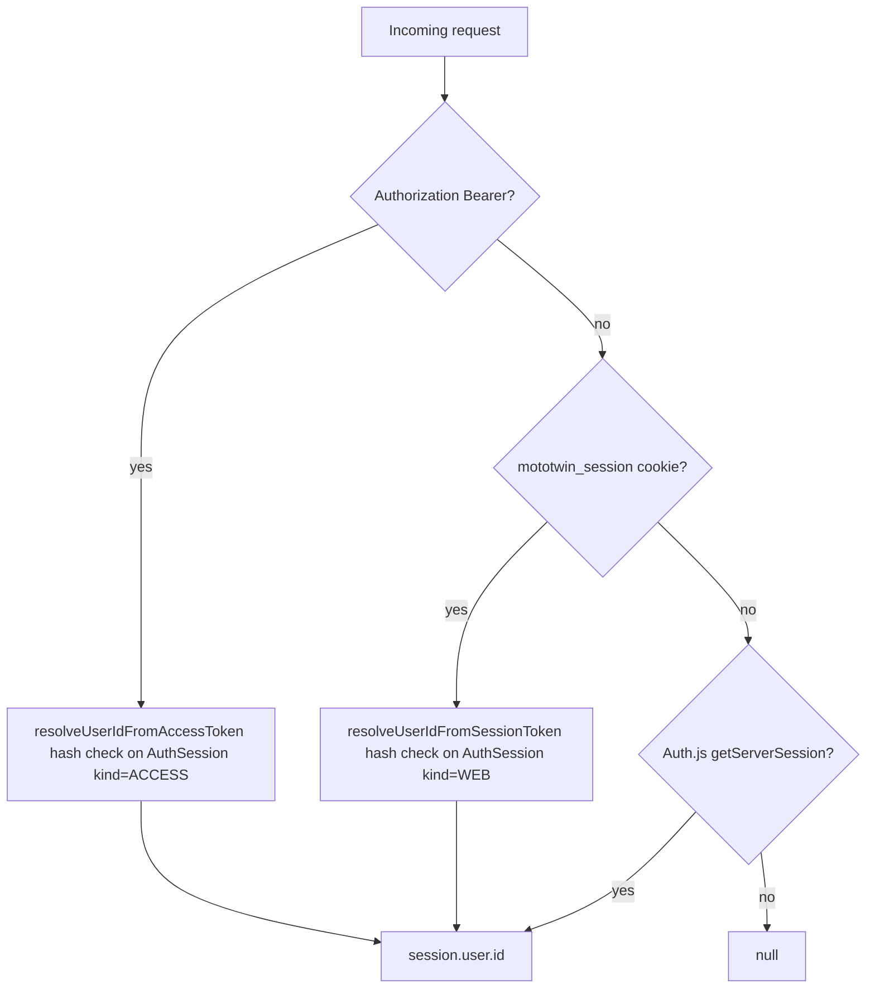

# API audit — OWASP API Security Top 10 (2023)

Скоуп: 122 route handler-а в 101 файле [`src/app/api/**/route.ts`](../../src/app/api/) + [`src/lib/auth/`](../../src/lib/auth/) + [`src/lib/admin-*.ts`](../../src/lib/) + [`src/app/api/_shared/`](../../src/app/api/_shared/).

Полный реестр находок с описанием — [findings.md](./findings.md). Здесь — разбор по 10 категориям с верификацией паттернов и evidence. Итерация 2 (Input validation audit, `MT-SEC-065`..`MT-SEC-075`) добавила полный обход всех 122 handler-ов на предмет `.strict()`, `.max()`, range-bounds, URL-валидации, body-size и search-params; resolved-статусы отражены в каждом разделе ниже и в [findings.md](./findings.md#сводка-статусов).

## Общая картина auth-стека

Три параллельных способа аутентификации, объединенные в [`src/lib/auth/request-auth.ts`](../../src/lib/auth/request-auth.ts):

Резолвинг владельца — через [`getCurrentUserContext()`](../../src/app/api/_shared/current-user-context.ts) (находит первый `Garage` с `ownerUserId = userId`) и [`getVehicleInCurrentContext()`](../../src/app/api/_shared/vehicle-context.ts) (двойная привязка к `garageId` и `ownerUserId`). Это хороший базовый паттерн.

## API1:2023 — Broken Object Level Authorization (BOLA)

**Вердикт:** в основном защищено через `getVehicleInCurrentContext`; точечные исключения в каталоге (`part-masters/[id]`, `parts/skus/[skuId]`) — намеренно публичные? — нужно подтвердить.

Проверено выборочно:

| Endpoint | Файл | Проверка владения | Статус |
|----------|------|---------------------|--------|
| `GET/PATCH /api/vehicles/[id]` | [vehicles/[id]/route.ts:37-44, 90-100](../../src/app/api/vehicles/[id]/route.ts) | `garageId + ownerUserId` | OK |
| `GET/PATCH /api/vehicles/[id]/profile` | profile/route.ts | через `getVehicleInCurrentContext` | OK |
| `GET /api/vehicles/[id]/installable` | [installable/route.ts:68-71](../../src/app/api/vehicles/[id]/installable/route.ts) | `getVehicleInCurrentContext` | OK |
| `POST /api/vehicles/[id]/usage-update` | [usage-update/route.ts:17-20](../../src/app/api/vehicles/[id]/usage-update/route.ts) | `getVehicleInCurrentContext` | OK |
| `GET/PATCH /api/vehicles/[id]/notification-settings` | [notification-settings/route.ts:19-21, 40-42](../../src/app/api/vehicles/[id]/notification-settings/route.ts) | `getVehicleInCurrentContext` | OK |
| `PATCH/DELETE /api/expenses/[expenseId]` | [expenses/[expenseId]/route.ts:69-82](../../src/app/api/expenses/[expenseId]/route.ts) | `assertExpenseInCurrentContext` → vehicle ownership | OK |
| `PATCH /api/notifications/[notificationId]/{read,seen,dismiss,snooze}` | [notifications/.../route.ts](../../src/app/api/notifications/) | `transitionNotificationStatus({userId, notificationId})` в [notifications.ts:599-603](../../src/lib/notifications.ts) — `findFirst({ id, userId })` | OK |
| `DELETE /api/push-subscriptions/[id]` | [push-subscriptions/[id]/route.ts:14-16](../../src/app/api/push-subscriptions/[id]/route.ts) | `findFirst({ id, userId })` | OK |
| `PATCH /api/vehicles/[id]/wishlist/[itemId]` | [wishlist/[itemId]/route.ts](../../src/app/api/vehicles/[id]/wishlist/[itemId]/route.ts) | `isVehicleInCurrentContext` + проверка `vehicleId` в where | OK |
| `POST /api/fitment/reports/[reportId]/votes` | [votes/route.ts:18-29](../../src/app/api/fitment/reports/[reportId]/votes/route.ts) | требует `moderationStatus === PUBLISHED` (публичные отчеты), голос привязан к `userId` | OK |
| `GET /api/part-masters/[id]` | [part-masters/[id]/route.ts:6-17](../../src/app/api/part-masters/[id]/route.ts) | **нет auth-чека вообще** — публичный каталог | См. `MT-SEC-039` |
| `GET /api/parts/skus/[skuId]` | [parts/skus/[skuId]/route.ts](../../src/app/api/parts/skus/[skuId]/route.ts) | **нет auth-чека** — публичный каталог | См. `MT-SEC-039` |
| `GET /api/motorcycle-brands` (и `motorcycle-model-families`, `motorcycle-variants`, `motorcycle-generations`) | [src/app/api/motorcycle-*/route.ts](../../src/app/api/) | **нет auth-чека** — публичный каталог моделей (4 уровня); legacy `brands` / `models` / `model-variants` удалены | См. `MT-SEC-039` |
| `GET /api/parts/recommended-skus` | [parts/recommended-skus/route.ts](../../src/app/api/parts/recommended-skus/route.ts) | **итерация 2:** `getVehicleInCurrentContext` (был полностью без auth) | `MT-SEC-073` (resolved) |
| `GET /api/part-masters/duplicates` | [part-masters/duplicates/route.ts](../../src/app/api/part-masters/duplicates/route.ts) | **итерация 2:** `getCurrentUserContext` + rate-limit (был полностью без auth) | `MT-SEC-073` (resolved) |
| `GET /api/geocode` | [geocode/route.ts](../../src/app/api/geocode/route.ts) | **итерация 2:** `getCurrentUserContext` + rate-limit 60/min/user (платный API, был полностью без auth → cost abuse) | `MT-SEC-074` (resolved) |

Каталожные эндпоинты (`motorcycle-brands`, `motorcycle-model-families`, `motorcycle-variants`, `motorcycle-generations`, `part-masters/[id]`, `parts/skus/[skuId]`, `nodes/*`) не требуют аутентификации — это может быть намеренно (анонимный браузинг каталога). Зафиксировано как **`MT-SEC-039`** (P2 — задокументировать решение, добавить allowlist «публично») вместе с API9 (inventory).

**Полная проверка всех 122 handler-ов** — выполнена в итерации 2 (Input validation audit). Шаблон `getVehicleInCurrentContext` единообразен; точечные исключения закрыты:

- **`MT-SEC-073`** (P0 IDOR, resolved) — `GET /api/parts/recommended-skus` ранее не требовал auth, и любой клиент мог передать произвольный `vehicleId` → получить fitment-контекст чужого ТС. Закрыто `getVehicleInCurrentContext(vehicleId, ...)` — auth + owner check.
- **`MT-SEC-073`** (P1 DoS, resolved) — `GET /api/part-masters/duplicates` ранее работал без auth → fuzzy DB-поиск без лимита. Закрыто `getCurrentUserContext()` + rate-limit 60/min/user.
- **`MT-SEC-074`** (P1, resolved) — `GET /api/geocode` — см. API4.

## API2:2023 — Broken Authentication

**Вердикт:** ядро auth корректное (bcrypt 12, hash-only хранение токенов, ротация refresh, revoke при сбросе пароля), но **нет защиты от brute force нигде** и **Yandex OAuth не проверяет audience**.

### Сильные стороны

- bcrypt(12), нормализация email перед сравнением, hash-only хранение всех токенов через HMAC-стиль `sha256(AUTH_SECRET:token)` в [tokens.ts:18-20](../../src/lib/auth/tokens.ts).
- Refresh-rotation: каждый `refresh` удаляет старый refresh + все access-сессии для пользователя ([session-service.ts:194-215](../../src/lib/auth/session-service.ts)).
- Сброс пароля ревокает **все** сессии пользователя (web + mobile + Auth.js) ([session-service.ts:390-405](../../src/lib/auth/session-service.ts)).
- Блокировка пользователя (`isBlocked`) ревокает все сессии и проверяется в auth-флоу ([admin/users/[id]/route.ts:85-87](../../src/app/api/admin/users/[id]/route.ts), [session-service.ts:307-315](../../src/lib/auth/session-service.ts)).
- Login: общий ответ `INVALID_CREDENTIALS` для «нет такого email» и «неверный пароль» ([session-service.ts:87-97](../../src/lib/auth/session-service.ts)) — нет account enumeration на login.
- Forgot password: единый 200 OK, токен возвращается только в dev ([forgot-password/route.ts:20-28](../../src/app/api/auth/forgot-password/route.ts)) — нет enumeration на forgot.

### Находки

- **`MT-SEC-001`** (P0) — `verifyYandex` не проверяет audience: любой valid Yandex OAuth access token любого приложения принимается. Atакующий, заведший своё Yandex-приложение с правом `login:email`, может выпустить токен от лица жертвы и войти как она в MotoTwin. См. [oauth-mobile.ts:78-105](../../src/lib/auth/oauth-mobile.ts).
- **`MT-SEC-002`** (P1) — нет rate limit ни на одном auth endpoint (`login`, `register`, `forgot-password`, `reset-password`, `refresh`, `oauth/mobile`). Подтверждено grep-ом по `rate.?limit|throttle`: ни одного матча в `src/`. Возможен brute force пароля, перебор reset-токенов, спам OAuth-запросами.
- **`MT-SEC-003`** (P1) — Apple Sign-In без nonce: [oauth-mobile.ts:62-65](../../src/lib/auth/oauth-mobile.ts) проверяет `issuer + audience`, но **не** проверяет `nonce`. `expo-apple-authentication` поддерживает `nonce`, но клиент ([apps/app/app/login.tsx:211-216](../../apps/app/app/login.tsx)) его не передает — replay identityToken возможен в окне жизни токена.
- **`MT-SEC-004`** (P1) — `register` возвращает `409 EMAIL_TAKEN` ([session-service.ts:36-39](../../src/lib/auth/session-service.ts)) — позволяет перечислять зарегистрированные email-ы.
- **`MT-SEC-005`** (P1) — `allowDangerousEmailAccountLinking: true` для Google/Apple/Yandex в [authjs.ts:100, 110, 118](../../src/lib/auth/authjs.ts). В сочетании с **`MT-SEC-001`** (Yandex audience не проверяется) это даёт сценарий account takeover: атакующий регистрирует Yandex-приложение, получает токен для своего email, который совпадает с email жертвы → линкуется к существующему `User` жертвы.
- **`MT-SEC-016`** (P2) — `ACCOUNT_BLOCKED` (403) отличается от `INVALID_CREDENTIALS` (401) — слабая enumeration: атакующий узнаёт, что аккаунт существует и заблокирован. См. [session-service.ts:90-92](../../src/lib/auth/session-service.ts).
- **`MT-SEC-010`** (P1) — на мобильном Yandex использует `AuthSession.ResponseType.Token` (implicit flow) — access token попадает в URL ([apps/app/app/login.tsx:48](../../apps/app/app/login.tsx)). Лучше PKCE + code flow.
- **`MT-SEC-021`** (P2) — dev-fallback `AUTH_SECRET` в [tokens.ts:8-12](../../src/lib/auth/tokens.ts) для не-production: приемлемо, но нужно явно валидировать в боевой сборке (boot-time assert, что `process.env.AUTH_SECRET` непустой).

## API3:2023 — Broken Object Property Level Authorization

**Вердикт:** mass assignment риск устранён в итерации 2 для топ-20 ручек через `strictObject()` helper; точечные ручки явно перечисляют целевые поля.

Проверенные представители:

- [user-settings/route.ts:11-27](../../src/app/api/user-settings/route.ts) — `userSettingsPatchSchema.strict()`, явный merge.
- [vehicles/[id]/route.ts:16-27](../../src/app/api/vehicles/[id]/route.ts) — `updateVehicleProfileSchema.strict()`.
- [expenses/[expenseId]/route.ts:34-55](../../src/app/api/expenses/[expenseId]/route.ts) — `patchExpenseSchema.strict()`.
- [admin/users/[id]/route.ts:9-12, 70-83](../../src/app/api/admin/users/[id]/route.ts) — `UpdateUserBlockSchema` с фиксированным набором полей.
- [push-subscriptions/route.ts:13-57](../../src/app/api/push-subscriptions/route.ts) — `pushSubscriptionSchema` (см. `_shared/notifications-http.ts`), update/create поля перечислены явно.

### Итерация 2 (`MT-SEC-068`, resolved для топ-20 ручек)

Введён [`src/lib/http/input-validation.ts`](../../src/lib/http/input-validation.ts) → `strictObject({ ... })` (alias `z.object({ ... }).strict()`, делает интент видимым на review). Применён к: `vehicles/*`, `expenses/*`, `wishlist/*`, `fitment/*`, `part-masters/*`, `service-events/*` (включая вложенный `rideProfile`), `admin/team`, `admin/parts/*`, `admin/users/[id]`, `admin/moderation/action`, `admin/models/[id]/support-level`, `moderation/part-masters/[id]`. Ранее покрытые `MT-SEC-038`/`MT-SEC-068` несколько ручек (`vehicles/route.ts`, `admin/parts/[id]/aliases`, `admin/parts/[id]/merge`) теперь явно `strict`. Полный диф — см. [findings.md#mt-sec-068](./findings.md#mt-sec-068-strict-пропущен-у-большинства-zod-схем--mass-assignment-surface).

Follow-up (~14 admin/notification routes): закрыть через ESLint-guard `no-restricted-syntax` на `z.object(` без `.strict()` — отдельная задача в [roadmap.md](./roadmap.md).

### Связанные находки итерации 2

- **`MT-SEC-066`** / **`MT-SEC-067`** (P1, resolved) — `z.any()` / `z.unknown()` на `installedPartsJson` / `formSnapshot` заменены на `boundedJsonValue({ maxSerializedBytes, maxDepth })` — open-structure JSON-поля теперь имеют верхнюю границу размера и глубины, что закрывает property-level injection через произвольные структуры.
- **`MT-SEC-070`** (P1, resolved для топ-15 schemas) — все user-controlled text/numeric поля capped (`boundedText`/`boundedNumber`/`boundedInt`/`boundedArray`).

## API4:2023 — Unrestricted Resource Consumption

**Вердикт:** в итерации 1 закрыты `MT-SEC-014`/`MT-SEC-015` для auth-ручек и outbound fetch; в итерации 2 закрыты `MT-SEC-066`/`MT-SEC-067`/`MT-SEC-069`/`MT-SEC-070`/`MT-SEC-071`/`MT-SEC-072`/`MT-SEC-074` для остальных write-ручек, JSON-полей произвольной формы, search-params и публичных платных эндпойнтов.

- **`MT-SEC-002`** (P1, resolved in-memory) — rate limit добавлен (см. API2).
- **`MT-SEC-014`** (P1, resolved для auth) — `parseJsonBody({ maxBytes })` в [src/lib/http/parse-json-body.ts](../../src/lib/http/parse-json-body.ts) применён к 6 auth ручкам; итерацией 2 расширен на ~25 write-handler-ов (см. `MT-SEC-069`).
- **`MT-SEC-015`** (P1, resolved) — `fetchWithTimeout` в [src/lib/http/fetch-with-timeout.ts](../../src/lib/http/fetch-with-timeout.ts) применён к [yandex-geocoder.ts](../../src/lib/yandex-geocoder.ts) и [oauth-mobile.ts](../../src/lib/auth/oauth-mobile.ts).
- **`MT-SEC-040`** (P2, resolved) — `/api/notifications/recalculate` 6/min/user; `/api/push-subscriptions/test` 3/min/user (см. [src/lib/http/rate-limit.ts](../../src/lib/http/rate-limit.ts)).
- **`MT-SEC-041`** (P2) — `/api/admin/search` — DoS-вектор от админ-роли остаётся (low likelihood); защищаться через debounce + take-кап + индексами имеет смысл.

### Итерация 2 — Input validation resource caps

- **`MT-SEC-066`** (P1, resolved) — `installedPartsJson: z.any()` / `z.unknown()` в `vehicles/[id]/service-events/*` заменено на `boundedJsonValue({ maxSerializedBytes: 64 KB, maxDepth: 24 })` в [src/lib/http/input-validation.ts](../../src/lib/http/input-validation.ts). Раньше atакующий с auth-cookie мог отправить вложенный JSON в 10 МБ.
- **`MT-SEC-067`** (P1, resolved) — `formSnapshot: z.unknown()` в `user-service-event-templates` → `boundedJsonValue({ 128 KB, depth 20 })`.
- **`MT-SEC-069`** (P1, resolved для топ-25 ручек) — `parseJsonBody({ maxBytes })` применён к expenses, vehicles, wishlist, fitment, part-masters, admin/team/parts/users/moderation, push-subscriptions, notification-settings, user-settings, auth/logout. Конкретные размеры — от 1 КБ (snooze) до 32 КБ (expenses POST/push-subscriptions). Полный список — [findings.md#mt-sec-069](./findings.md#mt-sec-069-нет-body-size-limit-на-большинстве-write-ручек).
- **`MT-SEC-070`** (P1, resolved для топ-15 schemas) — все user-controlled text/numeric поля capped через `boundedText`/`boundedNumber`/`boundedInt`/`boundedArray`: `comment`/`description`/`vendor` ≤ 2000 chars, `quantity` ≤ 10 000, `amount` ≤ 1B, `odometer` ≤ 10M, `items[]` ≤ 200, `installedExpenseItemIds[]` ≤ 500.
- **`MT-SEC-071`** (P2, resolved для топ-12 GET-ручек) — `parseSearchParamText`/`parseSearchParamInt` применён к expenses, admin/parts, fitment-reports, wishlist/kits.
- **`MT-SEC-072`** (P1, resolved) — `parts/recommended-skus`, `geocode`, `part-masters/duplicates` — search params length-capped перед DB/external API вызовами.
- **`MT-SEC-074`** (P1, resolved) — `/api/geocode` теперь требует auth + rate-limit 60/min/user (был полностью без auth, paid Yandex Geocoder API → cost abuse).

Follow-up: оставшиеся ~10 admin/notification routes (~14 schemas без `.strict()`, ~10 без `parseJsonBody`); интеграционные тесты на 413 PAYLOAD_TOO_LARGE — отдельная задача.

## API5:2023 — Broken Function Level Authorization

**Вердикт:** для `src/app/api/admin/**` — корректно (все 29 ручек импортируют `requireAdmin*` из [admin-auth.ts](../../src/lib/admin-auth.ts) и **вызывают** его в начале handler-а); для `src/app/api/moderation/**` — отдельный путь через `getCurrentUserContext().isModerator`, что **функционально эквивалентно**, но архитектурно расходится.

Сильные стороны:

- [admin/users/[id]/route.ts:19, 39](../../src/app/api/admin/users/[id]/route.ts), [admin/imports/route.ts:32, 56](../../src/app/api/admin/imports/route.ts), [admin/imports/[id]/commit/route.ts:11](../../src/app/api/admin/imports/[id]/commit/route.ts), [admin/audit-log/route.ts:7](../../src/app/api/admin/audit-log/route.ts), [admin/search/route.ts:13](../../src/app/api/admin/search/route.ts) — все начинаются с `await requireAnyAdmin()` или `await requireAdminRole([...])`.
- Для мутаций каталога — `requireAdminRole(["SUPER_ADMIN", "CATALOG_MANAGER"])`.
- Для блокировки пользователя — `requireAnyAdmin()` + явный запрет блокировать себя ([admin/users/[id]/route.ts:49-54](../../src/app/api/admin/users/[id]/route.ts)).
- Аудит-лог: [logAdminAction](../../src/lib/admin-audit.ts) вызывается на всех мутациях (выборочно подтверждено).

Находки:

- **`MT-SEC-024`** (P2) — разнобой RBAC: `moderation/**` использует `getCurrentUserContext().isModerator` напрямую ([moderation/part-masters/[id]/route.ts:15-17](../../src/app/api/moderation/part-masters/[id]/route.ts), [moderation/fitment/route.ts:8-10](../../src/app/api/moderation/fitment/route.ts), [fitment/reports/[reportId]/moderation/route.ts:17-19](../../src/app/api/fitment/reports/[reportId]/moderation/route.ts)), а не `requireAdminRole(["MODERATOR"])`. Функционально работает, но требует ручной синхронизации логики при изменении модели ролей.
- **`MT-SEC-042`** (P2) — `/api/notifications/recalculate` доступен любому залогиненному пользователю — это **намеренно** (юзер ре-калькулирует свои нотификации), но в комбинации с **`MT-SEC-040`** дает DoS-вектор.

## API6:2023 — Unrestricted Access to Sensitive Business Flows

**Вердикт:** beta-allowlist в проде закрывает регистрацию, throttle на forgot есть (60s/user), но другие чувствительные потоки (login, reset, oauth-mobile) — без anti-automation.

- **`MT-SEC-002`** (P1, см. API2) — открывает массу business-flow атак: brute force паролей, перебор reset-токенов (32 байта entropy, длинный, но без rate limit — теоретически перебор 2^256, на практике защищает только короткое окно жизни).
- Регистрация:
  - В проде закрыта allowlist-ом (`MOTOTWIN_BETA_ALLOWED_EMAILS`) — см. [beta-allowlist.ts:21-31](../../src/lib/auth/beta-allowlist.ts) — корректно.
  - В dev открыта — нормально.
- Forgot password throttle 60 сек/пользователь — см. [session-service.ts:337-348](../../src/lib/auth/session-service.ts) — закрывает только повторный запрос одного и того же email, **не закрывает** перебор разных email-ов от одного IP.
- **`MT-SEC-040`** (P2, см. API4) — `notifications/recalculate` и `push-subscriptions/test` без anti-abuse: пользователь может слать пуши себе циклом.

## API7:2023 — Server-Side Request Forgery (SSRF)

**Вердикт:** SSRF на серверной стороне нет — все outbound fetch имеют жестко зашитые URL (`yandex-geocoder`, `oauth-mobile.verifyYandex`, Google/Apple JWKS внутри `google-auth-library` / `jose`). Косвенный SSRF-вектор через user-controlled URL, отображаемый клиентом, закрыт в итерации 2.

- [yandex-geocoder.ts:1, 75](../../src/lib/yandex-geocoder.ts): `GEOCODE_BASE = "https://geocode-maps.yandex.ru/v1"` — константа; query/lat/lng идут в `URLSearchParams`, не в путь.
- [oauth-mobile.ts:82](../../src/lib/auth/oauth-mobile.ts): `fetch("https://login.yandex.ru/info?format=json")` — константа.
- `google-auth-library` и `jose.createRemoteJWKSet` ходят на свои provider-URL.
- Webhook-ручек, принимающих URL от пользователя — не обнаружено.

### Итерация 2 — косвенный SSRF через `fileUrl`

**`MT-SEC-065`** (P0 stored XSS + потенциальный косвенный SSRF, resolved) — `POST /api/fitment/evidence` принимал `fileUrl: z.string().trim().min(1)` без `.url()`, без `.max()`. Поле возвращалось в `<a href={e.fileUrl}>` и `<Image src={e.fileUrl}>` на странице `part-compatibility-report`. Атакующий мог записать `javascript:`, `data:`, `file:` URL или хост во внутренней сети → next/image optimizer попытался бы загрузить произвольный URL **с сервера** (вектор SSRF). Закрыто:

- `safeUrl({ max: 2048 })` zod-helper в [src/lib/http/input-validation.ts](../../src/lib/http/input-validation.ts) — scheme-allowlist `http(s):` only, отвергает `javascript:`/`data:`/`file:`.
- `safeRenderUrl` в [src/lib/http/safe-render-url.ts](../../src/lib/http/safe-render-url.ts) — defense-in-depth-фильтр для legacy записей в БД (применён в `vehicles/[id]/part-compatibility-report`).

Доп. защита (рекомендация в roadmap, не отдельная находка) — добавить allowlist hostname-ов для всех outbound fetch на этапе CI lint.

## API8:2023 — Security Misconfiguration

**Вердикт:** заметные пробелы — нет security headers, нет валидации ENV на boot, dev-mode error leakage.

- **`MT-SEC-006`** (P1) — нет security headers в [next.config.ts](../../next.config.ts):
  - не задан `headers()` для `Content-Security-Policy`, `Strict-Transport-Security`, `Referrer-Policy`, `Permissions-Policy`, `X-Frame-Options`, `X-Content-Type-Options`;
  - [deploy/nginx/mototwin.conf](../../deploy/nginx/mototwin.conf) тоже без них (и без TLS — но это `scope:infra`).
- **`MT-SEC-008`** (P2) — cookie `mototwin_session` без `__Host-` префикса, `sameSite:lax` ([login/route.ts:58-64](../../src/app/api/auth/login/route.ts)). Для админ-сегмента (`/admin/**`) допустимо рассмотреть `sameSite:strict`.
- **`MT-SEC-013`** (P2) — `nextResponseFromUnexpectedRouteError` при `NODE_ENV !== "production"` возвращает первые 220 символов error message ([route-error-response.ts:66-69](../../src/app/api/_shared/route-error-response.ts)). Само по себе ок, но если `NODE_ENV` случайно не выставлен в проде — утечка stack/SQL.
- **`MT-SEC-023`** (P2) — `MOTOTWIN_ENABLE_DEV_USER_SWITCHER` корректно отключён в проде через `isDevUserSwitcherEnabled()` (см. [current-user-context.ts:88-99](../../src/app/api/_shared/current-user-context.ts)), но `.env.example` рекомендует его включать локально — нужен warning в README и/или boot-time assert «в проде не включён».
- **`MT-SEC-043`** (P2) — нет валидации обязательных ENV на boot:
  - `AUTH_SECRET`, `DATABASE_URL`, `RESEND_API_KEY`, `AUTH_EMAIL_FROM`, `GOOGLE_OAUTH_CLIENT_ID`, `APPLE_CLIENT_ID`, `YANDEX_GEOCODER_API_KEY` — все проверяются «лениво» при первом обращении. В случае неконфигурированного боевого VPS пользователь увидит 500 при попытке OAuth, а не при старте Next.
- CORS: явных CORS-заголовков в route handler-ах нет — Next по умолчанию same-origin (мобильный делает запросы без CORS, поэтому работает). Это корректно: подтверждено grep-ом, что нет `Access-Control-Allow-Origin: *` в коде.

## API9:2023 — Improper Inventory Management

**Вердикт:** OpenAPI / реестра ручек нет, но в репо есть [docs/api-backend.md](../../docs/api-backend.md). Нужно дополнить полным списком ручек с тегами `auth: public/user/admin/moderator` и `deprecated`.

- **`MT-SEC-039`** (P2) — задокументировать и явно «защитить флагом» публичные каталожные ручки:
  - `GET /api/motorcycle-brands` — публичный;
  - `GET /api/motorcycle-model-families` — публичный;
  - `GET /api/motorcycle-variants` — публичный;
  - `GET /api/motorcycle-generations` — публичный;
  - `GET /api/part-masters/[id]` — публичный;
  - `GET /api/parts/skus/[skuId]` — публичный.
  Legacy-роуты `/api/brands`, `/api/models`, `/api/model-variants` удалены (см. [api-backend.md](../api-backend.md), [data-model.md](../data-model.md)).
  Решение: либо закрыть auth-ом, либо в коде явно пометить `// PUBLIC` (linter-rule) и добавить общий rate limit для публичных эндпоинтов.
- **`MT-SEC-044`** (P2) — дев-ручки в проде:
  - `/api/push-subscriptions/test` — выглядит как dev/QA, но не помечен и не закрыт.
  - `DEV_USER_HEADER_NAME` в `current-user-context.ts` — закрыт `isDevUserSwitcherEnabled()`, но flag-механика недокументирована публично.
- **`MT-SEC-045`** (P2) — построить актуальный реестр ручек: `(method, path, auth, body schema, deprecated?)` — это улучшит и API3, и BFLA-аудит на следующих итерациях.

## API10:2023 — Unsafe Consumption of APIs

**Вердикт:** ответы от Google/Apple валидируются (подпись + audience + issuer); Yandex — **не валидируется**, и это пересекается с `MT-SEC-001`.

- **`MT-SEC-001`** (P0, см. API2) — Yandex `accessToken` принимается без audience-проверки.
- **`MT-SEC-046`** (P2) — нет защиты от 5xx/timeout от Yandex/Google/Apple endpoints (см. `MT-SEC-015`). При downtime Google/Apple — пользователь получит 500, при downtime Yandex — 401 (intercepted в `verifyYandex`).
- Resend (`sendPasswordResetEmail`) — нужно проверить отдельно (файл [password-reset-email.ts](../../src/lib/auth/password-reset-email.ts) не читался в этой итерации; занесено в roadmap).

## Сводка по API-стриму

После двух итераций фиксов:

| Категория | Состояние | Связанные находки |
|-----------|-----------|-------------------|
| API1 BOLA | ✅ resolved (включая `MT-SEC-073` IDOR на `recommended-skus`); открыто `MT-SEC-039` (документировать public catalog) | `MT-SEC-039`, `MT-SEC-073` |
| API2 Auth | ✅ P0/P1 resolved; открыто `MT-SEC-004` (partial), `MT-SEC-010` (mobile Yandex code+PKCE) | `MT-SEC-001`, `MT-SEC-002`, `MT-SEC-003`, `MT-SEC-004`, `MT-SEC-005`, `MT-SEC-010`, `MT-SEC-016`, `MT-SEC-021` |
| API3 Property auth | ✅ resolved для топ-20 ручек (`MT-SEC-068`); открыто follow-up на ~14 routes | `MT-SEC-038`, `MT-SEC-068` |
| API4 Resource consumption | ✅ resolved для топ-25 write-ручек + JSON/text/numeric caps; открыто `MT-SEC-041` (admin/search debounce) | `MT-SEC-002`, `MT-SEC-014`, `MT-SEC-015`, `MT-SEC-040`, `MT-SEC-041`, `MT-SEC-066`, `MT-SEC-067`, `MT-SEC-069`, `MT-SEC-070`, `MT-SEC-071`, `MT-SEC-072`, `MT-SEC-074` |
| API5 BFLA | ✅ resolved (`MT-SEC-024` — moderation/* через `requireAdminRole`) | `MT-SEC-024`, `MT-SEC-042` |
| API6 Business flows | ✅ partial: rate-limit + throttle покрывают login/register/forgot; `MT-SEC-004` (202-flow) — открыт | `MT-SEC-002`, `MT-SEC-040`, `MT-SEC-074` |
| API7 SSRF | ✅ direct OK; косвенный через `fileUrl` (XSS+SSRF) — resolved (`MT-SEC-065`) | `MT-SEC-065` |
| API8 Misconfig | ✅ partial: headers без CSP (`MT-SEC-006`), env validation (`MT-SEC-043`), `MT-SEC-013`/`MT-SEC-023` — resolved; CSP — отдельно | `MT-SEC-006`, `MT-SEC-008`, `MT-SEC-013`, `MT-SEC-023`, `MT-SEC-043`, `MT-SEC-075` |
| API9 Inventory | ✅ inventory выполнен в итерации 2 (122 handler-а); `MT-SEC-039`/`MT-SEC-044`/`MT-SEC-045` — partial | `MT-SEC-039`, `MT-SEC-044`, `MT-SEC-045` |
| API10 Unsafe consumption | ✅ resolved (Yandex audience + timeouts) | `MT-SEC-001`, `MT-SEC-046` |

Полные детали и acceptance criteria — [findings.md](./findings.md) и [roadmap.md](./roadmap.md).
