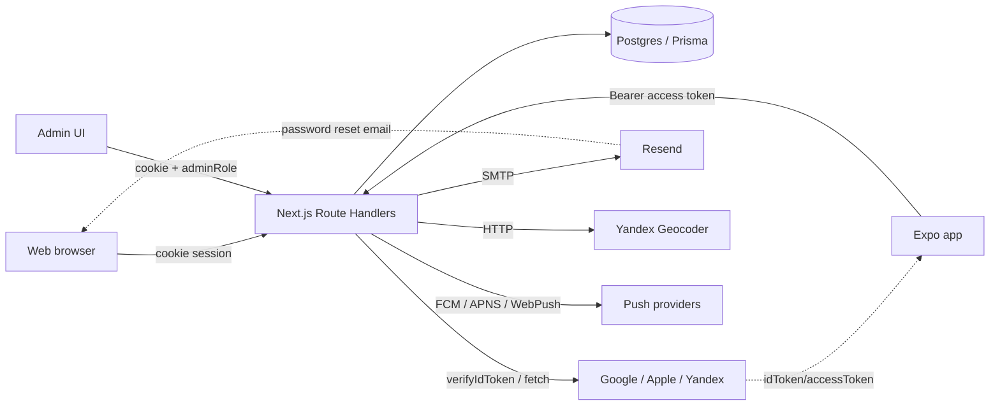
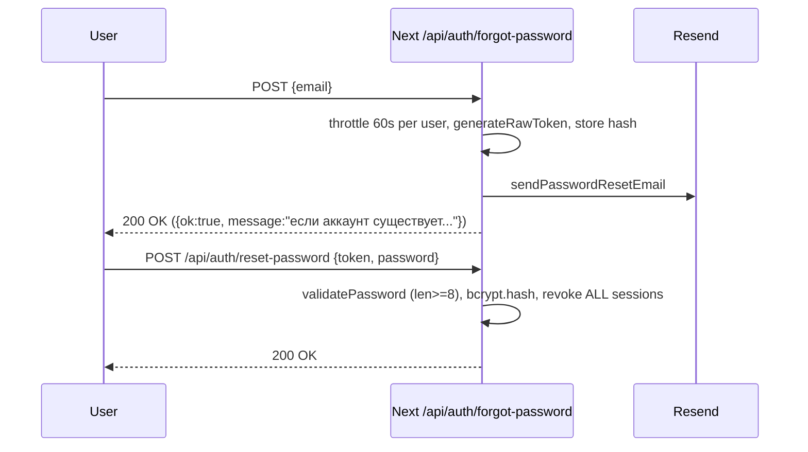

# MotoTwin — Threat model (lite)

Цель: зафиксировать активы, актеров, доверительные границы и основные потоки данных, чтобы привязать находки аудита к конкретным сценариям угроз.

Скоуп — только приложение (web + mobile + API). Инфраструктура (Nginx, Docker, systemd, VPS) — отдельной итерацией.

## 1. Активы

| Актив | Где живет | Чувствительность |
|-------|-----------|------------------|
| Учетные данные пользователя (`User.email`, `User.passwordHash`) | Postgres, таблица `User` | Высокая |
| Web-сессии (`AuthSession.kind = WEB`, cookie `mototwin_session`) | Postgres + cookie браузера | Высокая |
| Mobile access/refresh токены (`AuthSession.kind = ACCESS`, `RefreshToken`) | Postgres + iOS Keychain / Android Keystore через [`expo-secure-store`](https://docs.expo.dev/versions/latest/sdk/securestore/) | Высокая |
| Password reset токены (`PasswordResetToken`) | Postgres | Высокая (TTL 1 час) |
| PII — `displayName`, `email`, привязанные `Account` (OAuth) | Postgres | Средняя |
| Пользовательский контент: `Garage`, `Vehicle`, `ServiceEvent`, `ExpenseItem`, `PartWishlistItem`, `PushSubscription` | Postgres | Средняя (личная история ТО, расходы, координаты) |
| Координаты места установки (`ServiceEvent.installLocationLat/Lng/Address`) | Postgres | Средняя — геолокация |
| Push-токены (FCM/APNS) | Postgres | Средняя |
| Админ-операции: модерация, импорт каталога, аудит-лог (`AdminAuditLog`) | Postgres | Высокая для целостности каталога |
| Серверные секреты: `AUTH_SECRET`, `RESEND_API_KEY`, `YANDEX_GEOCODER_API_KEY`, OAuth client secrets | `.env` / процесс Next.js | Критическая |

## 2. Актеры

| Актер | Описание | Каналы доступа |
|-------|----------|----------------|
| Гость (anon) | Без сессии | `/login`, `/register`, `/forgot-password`, `/reset-password`, `/api/auth/*`, `/api/auth/oauth/mobile`, `/api/auth/[...nextauth]` |
| Пользователь | Авторизован cookie или Bearer | Все user-scoped API (`/api/vehicles/**`, `/api/expenses/**`, `/api/notifications/**`, …) |
| Beta-allowlisted | Email в `MOTOTWIN_BETA_ALLOWED_EMAILS` (в проде **регистрация** email+пароль только allowlist; **web OAuth не проверяет** этот список) | Регистрация открыта; см. [`src/lib/auth/beta-allowlist.ts`](../../src/lib/auth/beta-allowlist.ts) |
| Модератор | `User.isModerator = true` | `/api/moderation/**`, моде-эндпоинты |
| Админ | `User.adminRole IN (SUPER_ADMIN, CATALOG_MANAGER, ANALYST, MODERATOR)` | `/api/admin/**`, страницы `/admin/**`; см. [`src/lib/admin-auth.ts`](../../src/lib/admin-auth.ts) |
| Внешние интеграции | Google / Apple / Yandex OAuth (вход), Resend (письма сброса пароля), Yandex Geocoder (геокодинг), Web Push / FCM / APNS (нотификации) | Outbound + callbacks |

## 3. Trust boundaries



Границы доверия:

- **Browser ↔ Next API** — cookie `mototwin_session` (httpOnly, sameSite=lax, secure в проде). Защита от CSRF — sameSite=lax (см. [login/route.ts:58-64](../../src/app/api/auth/login/route.ts)). CSP/HSTS на уровне Next/Nginx отсутствуют.
- **Mobile ↔ Next API** — Bearer access token (15 мин TTL), refresh — 30 дней; токены в SecureStore.
- **Next API ↔ Postgres** — `DATABASE_URL` с паролем, локально `postgres/postgres`, в проде `mototwin_app` + bind на `127.0.0.1`.
- **Next API ↔ OAuth-провайдеры** — Google/Apple подтверждают подпись `idToken` против `audience = GOOGLE_OAUTH_CLIENT_ID / APPLE_CLIENT_ID`; Yandex — fetch `https://login.yandex.ru/info` с переданным access token, **без проверки audience**.
- **Mobile ↔ OAuth-провайдеры** — `expo-auth-session` (Google PKCE по умолчанию, Yandex implicit `ResponseType.Token`); `expo-apple-authentication` (нативный SDK).

## 4. Ключевые потоки

### 4.1 Web-вход через email/password

```mermaid
sequenceDiagram
    participant U as User browser
    participant N as Next /api/auth/login
    participant DB as Postgres
    U->>N: POST {email, password}
    N->>DB: SELECT User by email
    N->>N: bcrypt.compare(password, hash)
    N->>DB: INSERT AuthSession (kind=WEB, tokenHash)
    N-->>U: Set-Cookie mototwin_session=<rawToken>; httpOnly; sameSite=lax
```

Защиты: bcrypt(12), нормализация email, общий ответ `INVALID_CREDENTIALS` (нет ветви «email не найден»), блокировка через `User.isBlocked`, in-memory rate-limit на `login`/`register`/`forgot`/`reset`/`refresh`/`oauth/mobile` (`MT-SEC-002`, resolved), `parseJsonBody({ maxBytes })` на всех auth ручках (`MT-SEC-014`, resolved). Открыто: `MT-SEC-004` (полное закрытие enumeration через 202-flow + email — требует UX-итерации).

### 4.2 Mobile-вход через OAuth (Google/Apple/Yandex)

```mermaid
sequenceDiagram
    participant M as Mobile app
    participant P as OAuth provider
    participant N as Next /api/auth/oauth/mobile
    M->>P: AuthSession (Google: PKCE, Yandex: implicit)
    P-->>M: idToken / accessToken
    M->>N: POST {provider, idToken|accessToken}
    alt Google
        N->>N: google-auth-library.verifyIdToken(idToken, audience=GOOGLE_OAUTH_CLIENT_ID)
    else Apple
        N->>N: jose.jwtVerify(identityToken, jwks, iss=appleid.apple.com, aud=APPLE_CLIENT_ID)
    else Yandex
        N->>P: GET https://login.yandex.ru/info  (нет проверки audience)
    end
    N->>DB: upsert Account; create AuthSession + RefreshToken
    N-->>M: {accessToken, refreshToken, expiresAt}
```

После итерации 1 (resolved): Yandex-ветка проверяет `client_id` через introspection (`MT-SEC-001`); Apple — nonce (`MT-SEC-003`); `allowDangerousEmailAccountLinking` снят для Yandex (`MT-SEC-005`). Открыто: `MT-SEC-010` (mobile Yandex flow → code+PKCE).

### 4.3 Сброс пароля



Защиты: ответ единообразный (нет enumeration на forgot), 60-секундный throttle на одного пользователя, ротация всех сессий после сброса, глобальный in-memory rate-limit на `forgot`/`reset` (`MT-SEC-002`, resolved), masked email в логах + hard-fail на отсутствующий Resend в prod (`MT-SEC-022`, resolved). Открыто: политика пароля — только длина (`MT-SEC-012`), нет капчи.

### 4.4 BOLA-цепочка для пользовательских ресурсов

Каждый запрос на ресурс конкретного ТС/расхода/нотификации проходит через `getCurrentUserContext()` (см. [src/app/api/_shared/current-user-context.ts](../../src/app/api/_shared/current-user-context.ts)), который резолвит `userId` и **первый** `Garage.ownerUserId = userId`. Затем ресурс ищется через `getVehicleInCurrentContext()` (см. [src/app/api/_shared/vehicle-context.ts](../../src/app/api/_shared/vehicle-context.ts)):

```ts
prisma.vehicle.findFirst({
  where: {
    id: vehicleId,
    garageId: currentUser.garageId,
    garage: { ownerUserId: currentUser.userId },
  },
});
```

Резолвинг ресурса через **двойную привязку** к `garageId` и `ownerUserId` — корректный паттерн против BOLA. Расхождения с этим паттерном помечены в [api-findings.md](./api-findings.md).

После итерации 2 (Input validation audit) исправлено единственное точечное исключение: `GET /api/parts/recommended-skus` ранее не вызывал `getCurrentUserContext`/`getVehicleInCurrentContext` и принимал произвольный `vehicleId` (IDOR — `MT-SEC-073`); закрыт через `getVehicleInCurrentContext`. Публично-каталожные ручки (`brands`, `part-masters/[id]`, `parts/skus/[skuId]`) остаются по-прежнему публичными по дизайну (`MT-SEC-039`).

### 4.5 Input-validation surface (итерация 2)

Параллельно к BOLA введён единый набор helpers в [`src/lib/http/input-validation.ts`](../../src/lib/http/input-validation.ts) и [`src/lib/http/safe-render-url.ts`](../../src/lib/http/safe-render-url.ts), которые сужают доверительную границу «клиент → API» по трём осям:

- **Тело запроса**: `parseJsonBody({ maxBytes })` ([src/lib/http/parse-json-body.ts](../../src/lib/http/parse-json-body.ts)) → 413 для payload-ов больше лимита (по-разному для каждой ручки: 1–32 КБ).
- **Структура zod-схемы**: `strictObject({ ... })` (отвергает лишние поля), `boundedText`/`boundedNumber`/`boundedInt`/`boundedArray` (явные `min`/`max`), `boundedJsonValue({ maxSerializedBytes, maxDepth })` (open-structure JSON с serialized-size cap), `safeUrl({ max, requireHttps })` (scheme-allowlist `http(s):`).
- **Search params**: `parseSearchParamInt` / `parseSearchParamText` (length/range caps перед DB/external API).

Эти helpers — defense-in-depth слой между `clientRequest` (untrusted) и Prisma/external fetch (trusted dependencies). См. [findings.md#input-validation-audit](./findings.md#input-validation-audit-итерация-2--полный-обход-97-ручек--122-handler-ов).

## 5. Out-of-scope (на следующих итерациях)

- TLS на Nginx (сейчас `listen 80;` без `ssl`; см. [deploy/nginx/mototwin.conf](../../deploy/nginx/mototwin.conf)).
- Бэкапы / restore Postgres ([deploy/scripts/backup.sh](../../deploy/scripts/backup.sh)).
- Supply chain: `npm audit`, проверка `postinstall`, EAS-сборка, Metro bundle.
- Динамический pentest / fuzz API.
- Файлы в корне репозитория: `mototwin.dump`, `eng.traineddata`, `rus.traineddata`, README с тестовыми кредами — отмечены как `scope:infra` в [findings.md](./findings.md).
